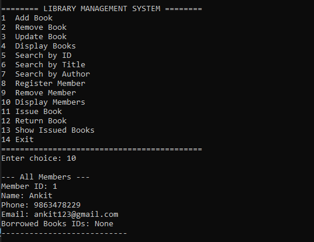
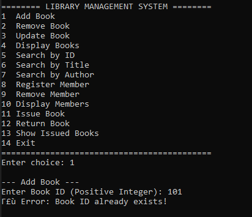

# 📚 Library Management System (C++)

A console-based **Library Management System** developed in **C++17** using **Object-Oriented Programming (OOP)**, **STL Containers**, and **File Handling**.

The application allows users to manage books and members, issue and return books, calculate fines, and store all records permanently using text files.

---

## ✨ Features

- 📖 Add Book
- ❌ Remove Book
- ✏️ Update Book
- 🔍 Search Book by ID
- 🔍 Search Book by Title
- 🔍 Search Book by Author
- 📚 Display All Books
- 👤 Register Member
- 🗑 Remove Member
- 👥 Display Members
- 📕 Issue Book
- 📗 Return Book
- ⏰ Due Date Tracking
- 💰 Fine Calculation
- 📋 Show Issued Books
- 💾 Automatic Data Saving
- 📂 Automatic Data Loading

---

## 🛠 Technologies Used

- C++17
- Object-Oriented Programming (OOP)
- Standard Template Library (STL)
- File Handling
- CMake
- VS Code

---

## 📂 Project Structure

```
Library-Management-System/
│
├── data/
│   ├── books.txt
│   ├── members.txt
│   └── issues.txt
│
├── include/
│   ├── Book.h
│   ├── Member.h
│   ├── Library.h
│   └── Utility.h
│
├── src/
│   ├── Book.cpp
│   ├── Member.cpp
│   ├── Library.cpp
│   ├── Utility.cpp
│   └── main.cpp
│
├── screenshots/
│
├── .gitignore
├── CMakeLists.txt
├── LICENSE
└── README.md
```

---

## ⚙️ Concepts Used

- Classes & Objects
- Encapsulation
- Constructors & Destructors
- STL Vector
- STL Map
- STL Unordered Map
- File Handling
- Data Serialization
- Menu Driven Programming

---

## 🚀 How to Build

### Using g++

```bash
g++ -std=c++17 -Iinclude src/main.cpp src/Book.cpp src/Member.cpp src/Library.cpp src/Utility.cpp -o library.exe
```

Run

```bash
./library.exe
```

---

## 📸 Screenshots

### Main Menu


---

### Add Book


---

### Display Books


---

### Register Member


---

### Display Members



---

### Issue Book


---

### Show Issued Books


---

### Return Book


---

### Search Book


---

### Duplicate Book Validation



---

### Data Persistence


---

## 💾 Data Storage

All application data is stored inside the **data/** directory.

```
books.txt
members.txt
issues.txt
```

Records are automatically loaded when the application starts and automatically saved whenever changes are made.

---

## 🎯 Future Improvements

- Admin Login
- Password Authentication
- GUI Version
- Database Integration (MySQL)
- QR Code Based Book Issue
- Barcode Scanner Support
- Book Reservation System

---

## 👨‍💻 Author

**Ankit**

Computer Science Engineering Student

---

## ⭐ If you found this project useful, consider giving it a star.
