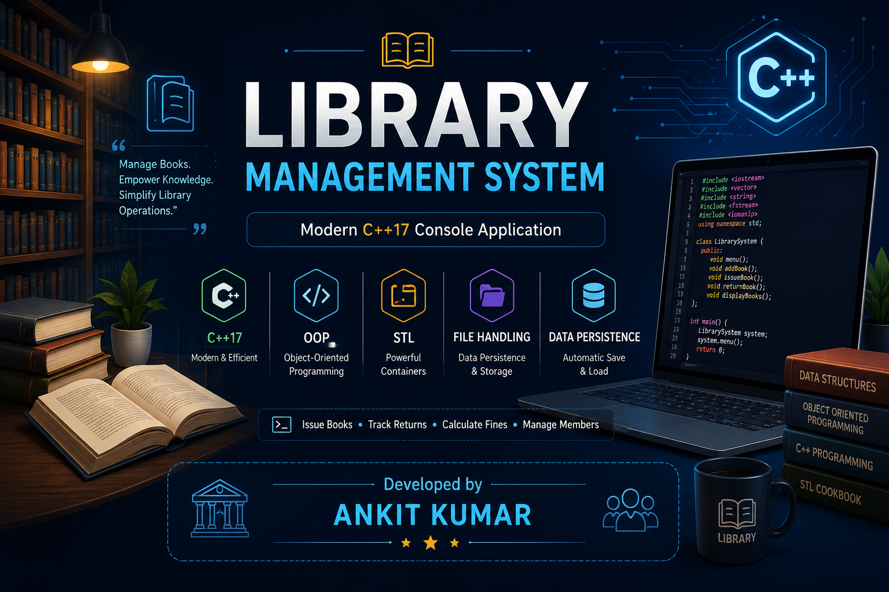
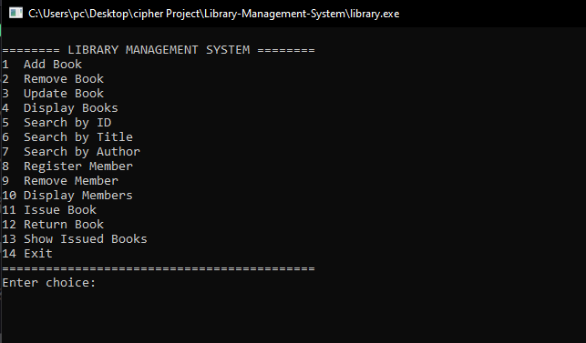
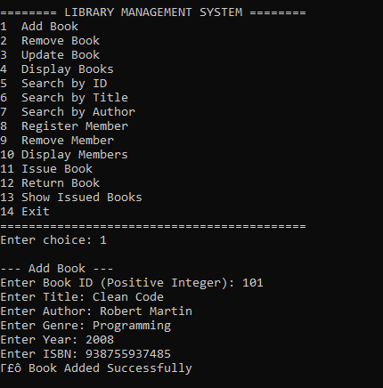
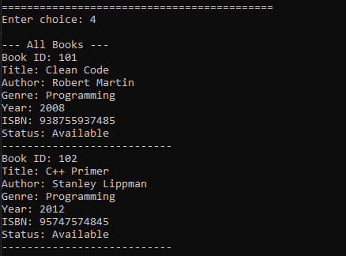
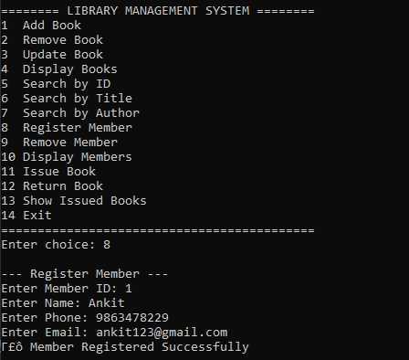
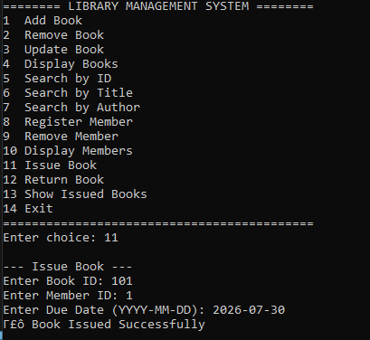
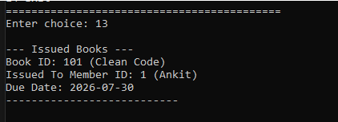
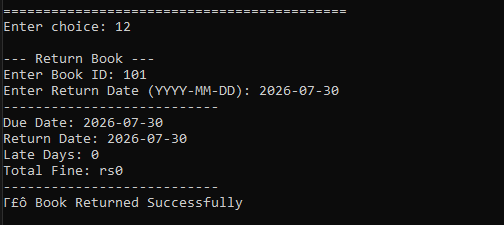
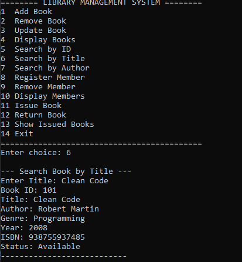
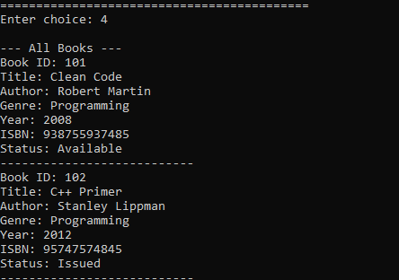

<div align="center">

# 📚 Library Management System

### A Modern C++17 Console Application for Efficient Library Management

Manage books, members, book issuing, returns, due dates, fines, and persistent storage using **Object-Oriented Programming**, **STL**, and **File Handling**.

<p align="center">


</p>



⭐ **If you like this project, consider giving it a Star!**

</div>

---

# 📖 Overview

The **Library Management System** is a console-based application developed in **C++17** that demonstrates the practical implementation of **Object-Oriented Programming (OOP)**, **STL Containers**, and **File Handling**.

The system enables efficient management of books and members by supporting operations such as adding, updating, searching, issuing, and returning books. It also includes **due date tracking**, **fine calculation**, and **automatic data persistence**, ensuring that records are securely stored and reloaded across program executions.

Designed with a modular architecture, this project highlights clean code practices, efficient data management, and real-world problem solving using modern C++.

---

# ✨ Key Features

| 📚 Book Management | 👤 Member Management | 📋 Library Operations |
|-------------------|----------------------|-----------------------|
| ✅ Add Book | ✅ Register Member | ✅ Issue Book |
| ✅ Remove Book | ✅ Remove Member | ✅ Return Book |
| ✅ Update Book | ✅ Display Members | ✅ Due Date Tracking |
| ✅ Search by ID | | ✅ Fine Calculation |
| ✅ Search by Title | | ✅ Show Issued Books |
| ✅ Search by Author | | |
| ✅ Display Books | | |

### Additional Features

- 💾 Automatic Data Saving
- 📂 Automatic Data Loading
- 🚫 Duplicate Book Validation
- 📁 Persistent File Storage
- ⚡ Fast Search using STL

---

# 🛠 Tech Stack

| Technology | Usage |
|------------|------|
| C++17 | Programming Language |
| OOP | Software Design |
| STL | Data Structures |
| File Handling | Persistent Storage |
| CMake | Build System |
| VS Code | IDE |

---

# 📂 Folder Structure

```text
Library-Management-System
│
├── data/
│   ├── books.txt
│   ├── members.txt
│   └── issues.txt
│
├── include/
│   ├── Book.h
│   ├── Library.h
│   ├── Member.h
│   └── Utility.h
│
├── src/
│   ├── Book.cpp
│   ├── Library.cpp
│   ├── Member.cpp
│   ├── Utility.cpp
│   └── main.cpp
│
├── screenshots/
|
├──.gitignore
├── README.md
└── CMakeLists.txt
```

---

# 🚀 Build & Run

### Compile

```bash
g++ -std=c++17 -Iinclude src/main.cpp src/Book.cpp src/Member.cpp src/Library.cpp src/Utility.cpp -o library.exe
```

### Run

```bash
./library.exe
```

---

# 📸 Application Preview

## 🏠 Main Menu



---

## 📖 Add Book



---

## 📚 Display Books



---

## 👤 Register Member



---

## 📕 Issue Book



---

## 📋 Issued Books



---

## 📗 Return Book



---

## 🔍 Search Book



---

## 💾 Data Persistence



---

# 🧠 C++ Concepts Demonstrated

- Object-Oriented Programming
- Encapsulation
- Constructors & Destructors
- Classes & Objects
- STL Vector
- STL Map
- STL Unordered Map
- File Handling
- Modular Programming
- Data Persistence

---

# 📈 Future Scope

- 🔐 Login System
- 🗄 MySQL Integration
- 🖥 GUI Version (Qt)
- 📱 QR Code Based Issue
- 📷 Barcode Scanner
- ☁ Cloud Storage
- 📊 Reports & Analytics Dashboard

---

# 👨‍💻 Author

<div align="center">
<h2>Ankit Kumar</h2>

🎓 **Computer Science Engineering Student**<br>
💻 **C++ • Object-Oriented Programming • Data Structures • STL**

<br>

<a href="https://github.com/Ankit-298">
    
</a>

</div>

---

<div align="center">

## ⭐ Thank You for Visiting!

If you found this project useful, consider giving it a ⭐ on GitHub.

Made with ❤️ using **C++** & **Object-Oriented Programming**

</div>

</div>
